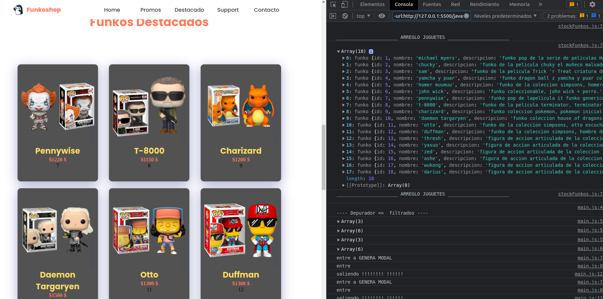

    <h1 align="center">eCommerce Funkoshop</h1>
    

    Página para la tercera entrega del proyecto final "javascript - coderhouse"; Ahora comenzamos a usar eventos y a interactuar con el DOM.
    funcionalidad incorporada en su matoria a la seccion Funkos Destacados: .

    <h3>Uso :</h3>
    <ul>
    <li>1) menu hamburguesa), usando eventos click y añadiendo una clase al nav se ñadaio un menu desplegable. si se clikea fuera tambien se repliega el mismo.</li>
    <li>2) todas las tarjetas de los productos se generan con js, se trae desde los arreglos de objetos, tanto las imagenes,los precios, los titulos y las descripciones. Tambien estructuras completas.</li>
    <li>3) El MODAL SOLO ESTA DE MUESTRA, solo permite visualizar el elemento, no asi realizar la compra desde el mismo.. al cliquear sobre la lupita de las tarjetas destacadas, estese desplirga. se aplicaron eventos para cerrar y abrir el mismo.</li>
    <li>4) sobre las tarjetas destacadas: se usan eventos como el mouseover y mouseout para cambiar de img. Si cliqueas sobre el boton de rotar, realiza la misma funcion pero con un evento click.</li>
    <li>5) al cliquear sobre el icono de carrito dentro de la tarjeta, se añade el producto a la lista de compra ("al carrito")</li>
    <li>6) al cliquear sobre el carrito de compra ("inferior derecha") se activa un evento click que permite desplegar la ventana del carrito actual. y podremos visualizar los elementos añadidos, la opcion de borrarlos individualmente y la de vaciar todo.</li>
    <li>7) Libreria swiperjs para el banner, nose si entraba en las consignas. Pueden surgir errores ya que se esta cambiando la vercion de la 7 a la 8.0.</li>
    <li>8) Seteo del carito hacia el local storage, transformandolo a JSON. y su recuperacion parseandolo para su posterior uso.</li>
    <li>Proximamente achicare y optimizare el codigo..</li>
    </ul>

 

## :pushpin: Vistazo a funkshop

 
## 👍 Espero te guste. 
Espero sea de tu agrado mi web.. a futuro si decido seguir con esta pagina, añadire un formulario de contacto, quizas todo en la misma pagina, um login y un buscador de productos quizas... ¡¡¡ ACEPTO SUGERENCIAS !!! ...
 

## :octocat: Mi contacto
#### :bust_in_silhouette: [Guillermo Agustín Neculqueo](@guillenec)
#### :house: [Homepage](https://procedilinux.netlify.app/index.html)	

#### :envelope: [guillermoneculqueo@gmail](guillermoneculqueo@gmail.com)